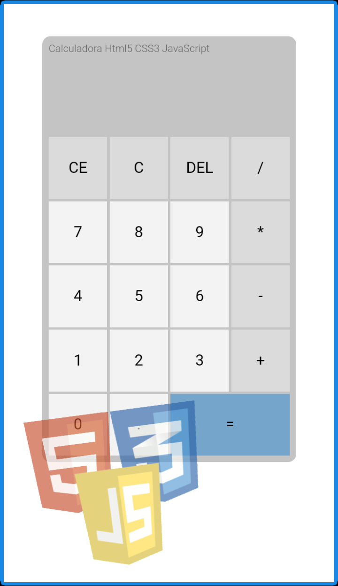

# Calculadora-Curso-JavaScript
`Calculadora na prática com Javascript - Curso Matheus Battisti Udemy` 

` Palavras Chaves / Declarações`
- ` const `: Constantes possuem escopo de bloco, semelhantes às variáveis declaradas usando o palavra-chave let. O valor de uma constante não pode ser alterado por uma atribuição, e ela não pod ser redeclarada.

- `document.querySelector`: Retorna o primeiro elemento dentro do documento (usando ordenação em profundidade, pré-ordenada e transversal dos nós do documento) que corresponde ao grupo especificado de seletores.

- `document.querySelectorAll`: Retorna uma lista de elementos presentes no documento (usando ordenação em profundidade, pré-ordenada e transversal dos nós do documento) que coincidam com o grupo de seletores especificado.

- `class`: As classes são um modelo para a criação de objetos. Eles encapsulam dados com código para trabalhar nesses dados. As classes em JS são construídas em protótipos, mas também possuem alguma sintaxe e semântica que são exclusivas das classes.

- `constructor`: The constructor method is a special method of a class for creating and initializing an object instance of that class.
